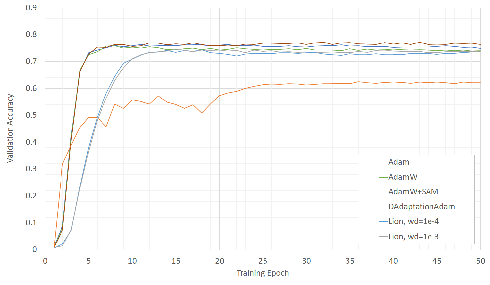
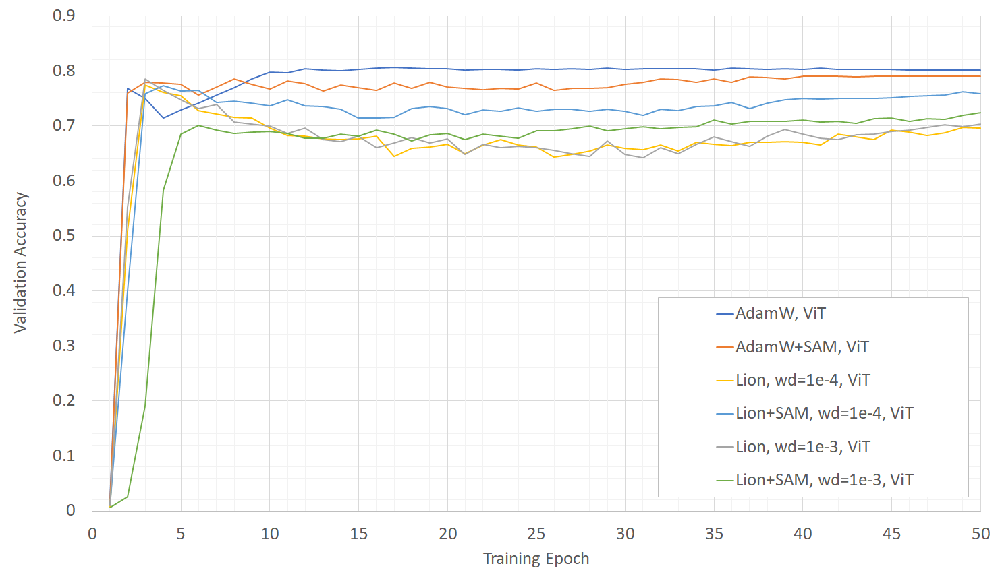
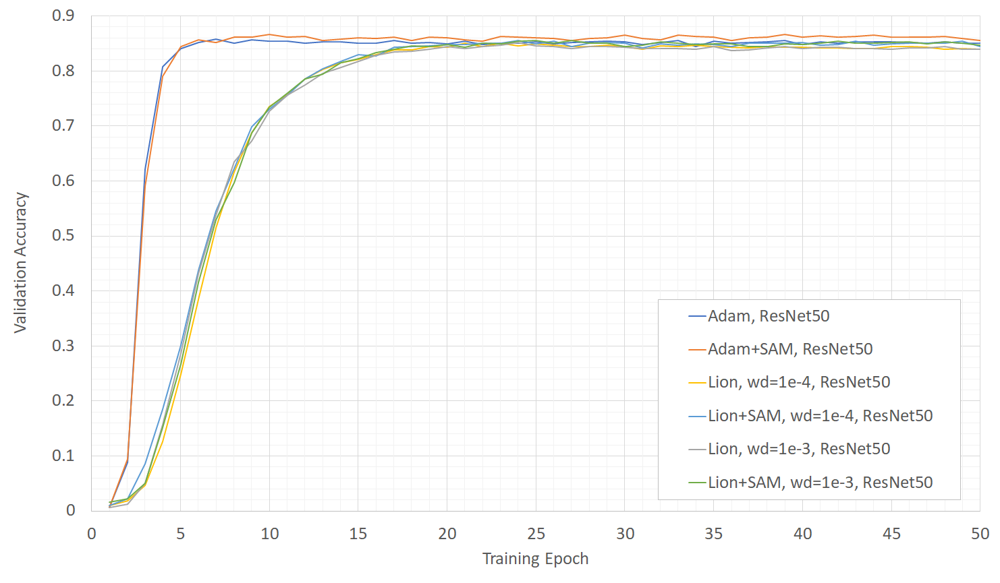

# Optimizer比較

いくつかのOptimizerについて精度・学習時間などの観点で実験した結果についてを示す.   
現在はAdam, AdamW, DAdaptationAdam, Lion に加えてSAMの併用した結果を挙げている.

## 概要
検証用Datasetについてはkaggleからダウンロードした学習データを利用.  
StratifiedKFoldによって5foldに分割し、そのうちの1foldを使用している.  
分割したファイルは sample_train.csv, sample_valid.csv としてリポジトリに配置している.  
    
D-Adaptationにはschedulerについては通常通りのものを利用との記載が見受けられたため、  
timm のスケジューラを利用して 3epoch の warmup を実施後に通常の lr となるように設定.  
  
オーグメンテーションなどの設定はコード記載通り.  

## 結果

以下のモデルで検証を行った結果をまとめる.  

* tf_efficientnet_b0
* vit_base_patch16_224
* resnet50

### tf_efficientnet_b0

| Optimizer |  Accuracy |  Training Time |  Initial LR | warmup LR | weight deacy |
| ---- | ---- | ---- | ---- | ---- | ---- |
|  Adam  | 0.764 | 981 sec. | 1e-4 | 1e-7 | - |
|  Adam+SAM  | 0.772 | 1605 sec. | 1e-4 | 1e-7 | - |
|  DAdaptAdam  | 0.625 | 1252 sec. | 1.0 | 1e-3 | - |
|  AdamW  | 0.758 | 1036 sec. | 1e-4 | 1e-7 | 1e-4 |
|  Lion  | 0.746 | 956 sec. | 1e-5 | 1e-8 | 1e-3 |
  
  
  
Lionのハイパーパラメータによる調査は[こちら](./result_lion.md)に記載.  
  
### vit_base_patch16_224

| Optimizer | Accuracy | Training Time | Initial LR | warmup LR | weight deacy |
| ---- | ---- | ---- | ---- | ---- | ---- |
|  Adam  | 0.779 | 1794 sec. | 1e-4 | 1e-7 | - |
|  Adam+SAM  | 0.795 | 3213 sec. | 1e-4 | 1e-7 | - |
|  AdamW  | 0.807 | 1807 sec. | 1e-4 | 1e-7 | 1e-4 |
|  AdamW+SAM  | 0.791 | 3216 sec. | 1e-4 | 1e-7 | 1e-4 |
|  Lion  | 0.775 | 1755 sec. | 1e-5 | 1e-8 | 1e-4 |
|  Lion+SAM  | 0.773 | 3171 sec. | 1e-5 | 1e-8 | 1e-4 |
|  Lion  | 0.786 | 1778 sec. | 1e-5 | 1e-8 | 1e-3 |
|  Lion+SAM  | 0.724 | 3188 sec. | 1e-5 | 1e-8 | 1e-3 |
  
  
  

### resnet50

| Optimizer | Accuracy | Training Time | Initial LR | warmup LR | weight deacy |
| ---- | ---- | ---- | ---- | ---- | ---- |
|  Adam  | 0.858 |  1778 sec.| 1e-4 | 1e-7 | - |
|  Adam+SAM  | 0.866 | 3240 sec. | 1e-4 | 1e-7 | - |
|  AdamW  | 0.860 |  1778 sec.| 1e-4 | 1e-7 |  1e-4  |
|  AdamW+SAM  | 0.867 | 3240 sec. | 1e-4 | 1e-7 | 1e-4 |
|  Lion  | 0.849 | 1752 sec. | 1e-5 | 1e-8 | 1e-4 |
|  Lion+SAM  | 0.856 | 3214 sec. | 1e-5 | 1e-8 | 1e-4 |
|  Lion  | 0.852 | 1745 sec. | 1e-5 | 1e-8 | 1e-3 |
|  Lion+SAM  | 0.856 | 3248 sec. | 1e-5 | 1e-8 | 1e-3 |
  


  
### 所見
Training Timeの計測はN=1であるためブレがあることに留意.  
現状のところ、メトリックの面ではAdam+SAMが指標面では優秀.  
ただし学習時間がおおよそ倍程度に伸びることから常用に関しては難がある.  
  
DAdaptationについては設定(または利用方法)が間違えているのか、指標があまり伸びなかった.  
lrの調整が不要になるとしても精度が伸びないのであれば選択肢から外れる.  
また学習epoch数が不足しているとしても学習時間の面で不利となるため活用が厳しいか.  

**UPD1**
DAdaptationの他者検証によるとそんなに悪くないというケースもあるようである.  
そのため、120クラス分類というタスクと相性もしくはセットアップが悪い可能性や  
下記の通りfp16を利用していることでなにかしら悪影響を及ぼしている可能性もある.  
  
2023/02/16に追加したLionについては、基本的にAdamより速いようである.  
(同一条件下ではAdamよりもLionのほうがいずれのケースでも早く終了していることから)  
efficientnet_b0では 0.05 ほどAdamより劣るが、  
ViTやResNet50であればだとおおよそ同じ程度のスコアが得られている.  
メモリ利用もAdam で10.2GB程度に対して 9.5GB程度と効率的なようである.  
省メモリかつ高速なのはよいが微妙に精度面で劣っている点が懸念.  

**UPD2**
LionはAdamWを用いる方が公平な比較であるとの指摘があったことから、  
PRを適用して weight_decay=1e-4 を導入・再度実験した.  
速度としては安定してAdamWよりも速くweight_decayを入れたことで精度に関してはほぼ同じ、  
厳しく見るとやや劣る程度かという印象がある.  
ただしここでは試行回数やランダムネスの検証が不足していることや、  
評価指標としてはValidation accuracy であるため汎化性能ではないことに注意.  

**UPD3**
現状のAdamWの設定はlr=1e-4, wd=1e-4であるため、
lr * wd を等しく保つとよいとの記載に従いlionの設定を変更.  
lr=1e-5, wd=1e-3にして再度実験して結果を更新.  
wd=1e-4よりもよくなっているように見受けられる.  
  
またViTではいずれのOptimizerであっても過学習で安定していないように見える.  
(warmupの間で最高値に到達していることがある)  
さらにlrをさげるかhead(最終層)のみtrainingするなどで  
改善するかどうかを試した方がよい可能性がある.

## 使用方法

### 1. ファイルの用意
下記に記載した引用元(kaggle)より画像データをダウンロード.  
train.py と同一のディレクトリに data/dog-breed-identification を展開する.  
具体的には下記のような構成となることを想定.

```bash
showcase-optimizer/data/dog-breed-identification/train/000bec180eb18c7604dcecc8fe0dba07.jpg
showcase-optimizer/data/dog-breed-identification/train/00a338a92e4e7bf543340dc849230e75.jpg
showcase-optimizer/data/dog-breed-identification/train/00a366d4b4a9bbb6c8a63126697b7656.jpg

...(省略)...

showcase-optimizer/data/dog-breed-identification/train/fff43b07992508bc822f33d8ffd902ae.jpg
showcase-optimizer/README.md
showcase-optimizer/sample_train.csv
showcase-optimizer/sample_valid.csv
showcase-optimizer/train.py
```

### 2. 学習実行
train.py のから試行したい optimizer を編集・選択(初期値ではAdamとしている).
```python
class CFG:
    #
    # ...
    #
    optimizer = 'Adam'
    # optimizer = 'SAM_Adam'
    # optimizer = 'DAdaptAdam'
```

### 3. 実行と出力
下記コマンドで実行する.  
```bash
python train.py >> log.txt
```

## 実験環境
実験設定・環境としては以下の通り.  
モデルおよびOptimizer、LRについては上記記載を採用.  
  
| 環境 |  |
| ---- | ---- |
| Framework | PyTorch 1.13.1 |
| image_size | 224 |
| num_classes | 120 |
| batch_size | 64 |
| epoch | 50 |
| amp | True (fp16) |
| CPU | AMD Ryzen 3700X |
| RAM | 64GB |
| GPU | NVIDIA RTX 4070 Ti | 

## ToDoなど
**Data Augmentation**  
オーグメンテーションなどはコード記載通りでResize以外なにもしていないので流石に実用としては甘すぎるか.  
HorizontalFlipなどは加えた方がよいかもしれない.  
  
**Config**  
Optimizerの設定が増えてきたのでconfigファイルなどを外だししたい.  
jsonなどで切り替えられるようにすると実験ミスなどが減る想定.
  
**amp(fp16/bf16)**
現状はfp16を用いて検証しているが、fp32/bf16の検証結果も記載したい.  

**サンプル増し検証**
seedを固定しておらず、N=1での実験結果であるためブレが存在すると想定される.  
計算速度や精度を踏まえるとN=3程度は回して検証したい.  

## 引用
* Dataset  
kaggleの[dog-breed-identification](https://www.kaggle.com/c/dog-breed-identification)より引用.  
  
* SAM  
論文は[Sharpness-Aware Minimization for Efficiently Improving Generalization](https://arxiv.org/abs/2010.01412)  
実装については[このリポジトリ](https://github.com/davda54/sam/)から引用. 
  
* D-Adaptation(DAdaptAdam)  
論文は[Learning-Rate-Free Learning by D-Adaptation](https://arxiv.org/abs/2301.07733)  
[D-Adaptation](https://github.com/facebookresearch/dadaptation)の実装を利用. 

* Lion  
論文は[Symbolic Discovery of Optimization Algorithms](https://arxiv.org/abs/2302.06675)  
[Lion - Pytorch](https://github.com/lucidrains/lion-pytorch)の実装を利用.
