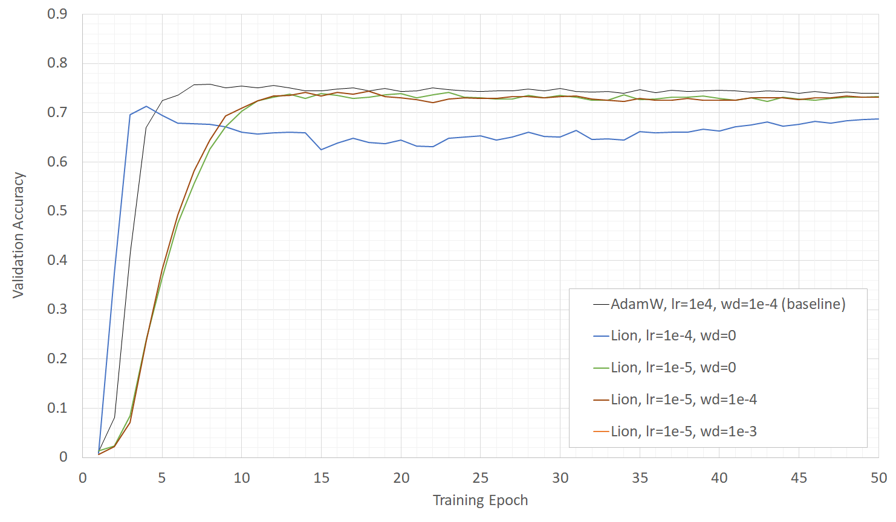

## Lion

Lion のハイパーパラメータ調査.  
lrに関しては効果が大きいのでAdamWのx0.1を適用するとよいようだ.  
wdに関してはあまり大きな差は得られていないが、実験結果の上では  
Learning_rate x weight_decay の関係を用い AdamW の設定値と同じにするとよいように見える.  

### tf_efficientnet_b0
| Optimizer |  Accuracy |  Training Time |  Initial LR | warmup LR | weight deacy |  
| ---- | ---- | ---- | ---- | ---- | ---- |  
|  Lion  | 0.713 | 836 sec. | 1e-4 | 1e-7 | - |  
|  Lion  | 0.739 | 908 sec. | 1e-5 | 1e-8 | - |  
|  Lion  | 0.744 | 961 sec. | 1e-5 | 1e-8 | 1e-4 |  
|  Lion  | 0.746 | 956 sec. | 1e-5 | 1e-8 | 1e-3 |  
  
  
  
